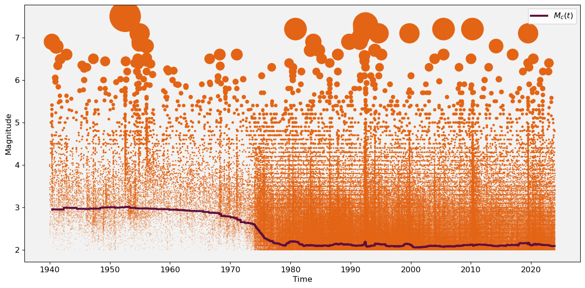
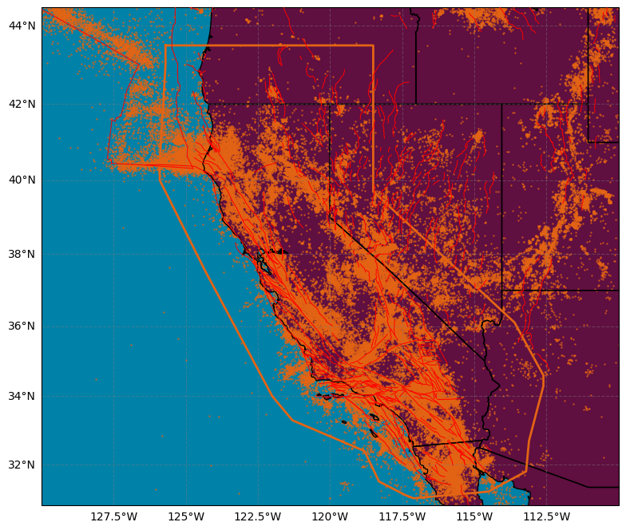
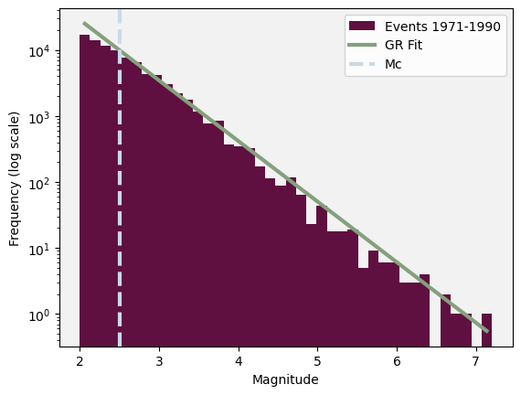
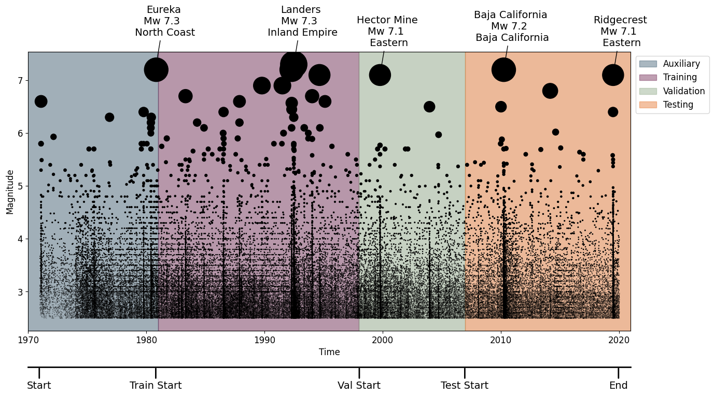

# ANSS Comprehensive Earthquake Catalog (ComCat) [1]

The U.S. Geological Survey (USGS) National Earthquake Information Center (NEIC) monitors global earthquakes (Mw 4.5 or larger) and provides complete seismic monitoring of the United States for all significant earthquakes (> Mw 3.0 or felt).

Their catalog, the Advanced National Seismic System (ANSS) Comprehensive Catalog of Earthquake Events and Products (ComCat), has been produced from many contributing seismic networks:

| Catalog | Time Period |
|---------|-------------|
| AK - [Alaska Earthquake Center](https://earthquake.usgs.gov/data/comcat/catalog/ak/) | 1975-01-30 00:00:00 to 2020-10-20 20:25:03 |
| AT - [National Tsunami Warning Center](https://earthquake.usgs.gov/data/comcat/catalog/at/) | 2011-03-12 13:15:44 to 2020-01-28 19:10:27 |
| ATLAS - [ShakeMap Atlas](https://earthquake.usgs.gov/data/comcat/catalog/atlas/) | 1960-01-13 15:40:22 to 2013-06-21 12:33:59 |
| AV - [Alaska Volcano Observatory](https://earthquake.usgs.gov/data/comcat/catalog/av/) | 2018-01-01 10:03:35 to 2020-10-19 19:39:24 |
| CDMG - [cdmg](https://earthquake.usgs.gov/data/comcat/catalog/cdmg/) | 1856-09-21 07:30:00 to 1884-03-26 00:40:00 |
| CGS - [cgs](https://earthquake.usgs.gov/data/comcat/catalog/cgs/) | 2017-08-11 00:59:35 to 2017-08-11 00:59:35 |
| CHOY - [Energy Magnitude and Broadband Depth](https://earthquake.usgs.gov/data/comcat/catalog/choy/) | 1992-06-26 01:32:27 to 2007-09-26 15:00:43 |
| CI - [California Integrated Seismic Network: Southern California Seismic Network (Caltech/USGS Pasadena and Partners) and Southern California Earthquake Data Center](https://earthquake.usgs.gov/data/comcat/catalog/ci/) | 1925-06-29 14:42:16 to 2020-10-20 20:01:53 |
| DUPUTEL - [Duputel et al. W phase catalog](https://earthquake.usgs.gov/data/comcat/catalog/duputel/) | 1996-11-05 09:41:34 to 1996-11-05 09:41:34 |
| EQH - [EQH - Coffman, von Hake and Stover, Earthquake History of the United States](https://earthquake.usgs.gov/data/comcat/catalog/eqh/) | 1867-11-18 18:45:00 to 1868-03-17 11:15:00 |
| GCMT - [Lamont-Doherty Earth Observatory Global CMT project, New York, USA](https://earthquake.usgs.gov/data/comcat/catalog/gcmt/) | 1977-11-27 08:36:05 to 2016-02-19 09:30:00 |
| HV - [Hawaii Volcano Observatory](https://earthquake.usgs.gov/data/comcat/catalog/hv/) | 1959-10-02 06:29:05 to 2020-10-20 17:40:57 |
| ISCGEM - [ISC-GEM Main Catalog](https://earthquake.usgs.gov/data/comcat/catalog/iscgem/) | 1900-07-29 06:59:00 to 2010-02-27 10:30:10 |
| ISCGEMSUP - [ISC-GEM Supplementary Catalog](https://earthquake.usgs.gov/data/comcat/catalog/iscgemsup/) | 1904-06-25 14:45:39 to 1972-12-28 18:23:58 |
| ISMPKANSAS - [USGS Induced Seismicity Project (Kansas)](https://earthquake.usgs.gov/data/comcat/catalog/ismpkansas/) | 2014-05-09 11:17:29 to 2019-07-24 12:07:01 |
| LD - [Lamont-Doherty Cooperative Seismographic Network](https://earthquake.usgs.gov/data/comcat/catalog/ld/) | 2001-01-17 12:34:23 to 2020-01-21 16:50:56 |
| MB - [Montana Bureau of Mines and Geology](https://earthquake.usgs.gov/data/comcat/catalog/mb/) | 1999-11-30 00:00:00 to 2020-10-20 11:50:49 |
| NC - [California Integrated Seismic Network: Northern California Seismic System (UC Berkeley, USGS Menlo Park, and Partners)](https://earthquake.usgs.gov/data/comcat/catalog/nc/) | 1966-07-01 01:17:36 to 2020-10-20 18:39:37 |
| NM - [New Madrid Seismic Network](https://earthquake.usgs.gov/data/comcat/catalog/nm/) | 1974-06-29 09:27:10 to 2020-10-20 18:50:22 |
| NN - [Nevada Seismological Laboratory](https://earthquake.usgs.gov/data/comcat/catalog/nn/) | 2000-01-01 00:20:03 to 2020-10-20 20:04:53 |
| OFFICIAL - [USGS Earthquake Magnitude Working Group](https://earthquake.usgs.gov/data/comcat/catalog/official/) | 1638-06-11 19:00:00 to 2012-04-11 08:38:37 |
| OK - [ok](https://earthquake.usgs.gov/data/comcat/catalog/ok/) | 2019-03-03 04:55:04 to 2020-10-20 16:22:17 |
| PR - [Puerto Rico Seismic Network](https://earthquake.usgs.gov/data/comcat/catalog/pr/) | 2011-07-01 04:19:42 to 2020-10-20 19:26:02 |
| PT - [Pacific Tsunami Warning Center](https://earthquake.usgs.gov/data/comcat/catalog/pt/) | 2011-03-20 12:04:06 to 2020-10-01 10:34:47 |
| SC - [sc](https://earthquake.usgs.gov/data/comcat/catalog/sc/) | 2008-11-13 18:00:00 to 2008-11-13 18:00:00 |
| SE - [Center for Earthquake Research and Information](https://earthquake.usgs.gov/data/comcat/catalog/se/) | 1977-05-29 16:04:28 to 2020-10-19 20:19:38 |
| US - [USGS National Earthquake Information Center, PDE](https://earthquake.usgs.gov/data/comcat/catalog/us/) | 1973-01-01 03:46:10 to 2020-10-20 18:57:55 |
| USHIS - [USHIS - Stover and Coffman, Seismicity of the United States, 1568-1989](https://earthquake.usgs.gov/data/comcat/catalog/ushis/) | 1663-02-05 22:30:00 to 1980-11-08 17:14:40 |
| UU - [University of Utah Seismograph Stations](https://earthquake.usgs.gov/data/comcat/catalog/uu/) | 1876-03-22 00:00:00 to 2020-10-20 17:36:41 |
| UW - [Pacific Northwest Seismic Network](https://earthquake.usgs.gov/data/comcat/catalog/uw/) | 1882-05-01 06:50:00 to 2020-10-20 15:45:18 |


## Downloading the dataset

We begin by importing the neccessary dependencies


```python
import pandas as pd
import numpy as np
import urllib.request
import shutil
import os
import matplotlib.pyplot as plt
from datetime import datetime, timedelta
from dateutil.relativedelta import relativedelta
import math
import warnings
warnings.filterwarnings('ignore')
from scipy.ndimage import uniform_filter1d
import geopandas as gpd
import cartopy.crs as ccrs
import cartopy.feature as cfeature
from shapely.geometry import Polygon
import sys
sys.path.append('..')
from plot_utils import download_USGS_in_windows, combine_csv_files, maxc, azimuthal_equidistant_projection
from scipy.stats import linregress

# Custom Colormap
colors = ["#5F0F40", "#C9DAEA", "#84A07C", "#E36414", "#39A9DB", "#0081A7", "#284B63", "#FFD449"]
```


We can now specify the parameters we will use to download the catalog from the USGS. Since the raw catalog is very large, we will need to download it in 6 month intervals. We will only download earthquakes above magnitude 2.0. As we will later see, this includes earthquakes below the completeness of our final catalog.

Data can be downloaded from https://earthquake.usgs.gov/earthquakes/search/.


```python
# Download Parameters
start_year, start_month = 1940, 1 
end_year, end_month = 2023, 12
window_size_months = 6
max_lat, min_lat, max_lon, min_lon = 44.45, 30.79, -110, -130
minimum_magnitude = 2.0
```


```python
# Download data in specified windows
filenames = download_USGS_in_windows(start_year, start_month, end_year, end_month, window_size_months, max_lat, min_lat, max_lon, min_lon, minimum_magnitude)
# filenames = [os.path.join('raw', f) for f in os.listdir('raw')]
combine_csv_files(filenames,'raw/1940_2023.csv')
```

We can now read the combined catalog.


```python
raw_catalog = pd.read_csv("raw/1940_2023.csv")
raw_catalog['time'] = pd.to_datetime(raw_catalog['time']).dt.tz_convert(None)
raw_catalog = raw_catalog.sort_values(by='time')
raw_catalog.reset_index(drop=False, inplace=True)
raw_catalog.rename(columns={'mag': 'magnitude','index': 'id'}, inplace=True)
raw_catalog = raw_catalog[["time", "longitude", "latitude","magnitude"]].dropna()
print('the raw catalog has', len(raw_catalog),'events')
raw_catalog.head()
```

    the raw catalog has 301293 events


<div>
<style scoped>
    .dataframe tbody tr th:only-of-type {
        vertical-align: middle;
    }

    .dataframe tbody tr th {
        vertical-align: top;
    }

    .dataframe thead th {
        text-align: right;
    }
</style>
<table border="1" class="dataframe">
  <thead>
    <tr style="text-align: right;">
      <th></th>
      <th>time</th>
      <th>longitude</th>
      <th>latitude</th>
      <th>magnitude</th>
    </tr>
  </thead>
  <tbody>
    <tr>
      <th>0</th>
      <td>1940-01-01 12:49:28.010</td>
      <td>-115.986500</td>
      <td>32.578333</td>
      <td>3.46</td>
    </tr>
    <tr>
      <th>1</th>
      <td>1940-01-01 18:42:24.630</td>
      <td>-115.389167</td>
      <td>33.158500</td>
      <td>3.58</td>
    </tr>
    <tr>
      <th>2</th>
      <td>1940-01-04 07:15:33.010</td>
      <td>-117.224000</td>
      <td>34.012500</td>
      <td>2.65</td>
    </tr>
    <tr>
      <th>3</th>
      <td>1940-01-04 08:07:10.570</td>
      <td>-116.187833</td>
      <td>33.223000</td>
      <td>4.01</td>
    </tr>
    <tr>
      <th>4</th>
      <td>1940-01-05 06:20:50.460</td>
      <td>-119.442000</td>
      <td>32.929333</td>
      <td>3.97</td>
    </tr>
  </tbody>
</table>
</div>


## Visualising the Catalog

Let's plot events in the raw catalog over time along with an estimate of the completeness using Maximum Curvature [2].
We can see significant improvements that were made to the network during the 1970s and 1980s. By 1980 it appears to be relatively stable.


```python
%matplotlib inline
plt.figure(figsize=(15, 7))
plt.gca().set_facecolor((0.95, 0.95, 0.95))

# Compute M_c(t) across the raw catalog
window_size=300
nwindows = math.floor(len(raw_catalog['magnitude'])/window_size)

Mc_t = [0]*nwindows
mid_time = [0]*nwindows

comp_T = raw_catalog['time']
comp_M = raw_catalog['magnitude']

for i in range(nwindows):
    
    mid_time[i] =  pd.Timestamp(pd.Series(comp_T[i*window_size:(i+1)*window_size]).mean())

    window = comp_M[i*window_size:(i+1)*window_size]
    Mc_t[i] = maxc(window,0.05)

# Smooth M_c(t) for plotting
Mc_t = uniform_filter1d(Mc_t, size=40)

# Plotting
plt.step(mid_time,Mc_t,colors[0],label=r'$M_c(t)$',lw=3)
z = (9.5**raw_catalog['magnitude'])*0.0001
plt.scatter(raw_catalog['time'],raw_catalog['magnitude'],s=z,color =colors[3])
plt.xlabel('Time',fontsize=12)
plt.ylabel('Magnitude',fontsize=12)
plt.xticks(fontsize=12)
plt.yticks(fontsize=12)
plt.legend(fontsize=12)
plt.show()
```


    

    


Let's now visualise the coordinates of the events in the catalog.


```python
# Read the GEM fault data
gdf = gpd.read_file('/home/ss15859/Downloads/gem_active_faults.gpkg')
faults = gdf.geometry

# Filter the GeoDataFrame to include only geometries within the specified extent
filtered_gdf = gdf.cx[min_lon:max_lon, min_lat:max_lat]

# Extract the geometry of the faults within the specified extent
faults_within_extent = filtered_gdf.geometry


# Create a figure with Cartopy
fig = plt.figure(figsize=(10.5, 8.1))

ax = fig.add_subplot(1, 1, 1, projection=ccrs.Mercator())
ax.set_extent([-130, -110, 30.79, 44.45], crs=ccrs.PlateCarree())

# Add colored land and ocean
ax.add_feature(cfeature.LAND, facecolor="#5F0F40")
ax.add_feature(cfeature.OCEAN, facecolor="#0081A7")
ax.add_feature(cfeature.STATES, edgecolor='black')


# Plot the faults
for geom in faults_within_extent:
    ax.plot(geom.xy[0], geom.xy[1], color='red', transform=ccrs.PlateCarree(),zorder=10,linewidth=0.7)


# Add gridlines with customization
gl = ax.gridlines(draw_labels=True, color='gray', linestyle='--', alpha=0.4)
gl.right_labels = False
gl.top_labels = False
ax.tick_params(axis='x', labelsize=16)
ax.tick_params(axis='y', labelsize=16)


# Plot polygon
polygon_coords = np.load('california_shape.npy')
plot_polygon_coords = np.append(polygon_coords, [polygon_coords[0]], axis=0)
ax.plot(plot_polygon_coords[:, 1], plot_polygon_coords[:, 0], transform=ccrs.PlateCarree(), color=colors[3], lw=2)

# Plot events
ax.scatter(raw_catalog['longitude'], raw_catalog['latitude'], transform=ccrs.PlateCarree(), s=0.4, color=colors[3], alpha=0.8)
plt.show()
```


    

    


## Truncating the catalog

For this catalog, we define the target region to be the same as the RELM and CSEP experiments [3],[4].

We will now truncate the catalog in time, the time-varying completeness figure.

Since the catalog is most complete by 1980, this period onwards will constitute the begining of the training data. However, in order to include information contained in the events collected between 1970-1980, we will truncate the catalog at 1971 and use this initial period in the auxiliary window.


```python
## filter events within polygon
poly = Polygon(polygon_coords)
gdf = gpd.GeoDataFrame(
    raw_catalog,
    geometry=gpd.points_from_xy(
        raw_catalog.latitude, raw_catalog.longitude),)

catalog = gdf[gdf.intersects(poly)].copy()
catalog.drop("geometry", axis=1, inplace=True)
len_trunc_x = len(catalog)
print('Removed',len(raw_catalog)-len_trunc_x, 'events outside polygon')

# filter events within timewindow
auxiliary_start = '1971-01-01 00:00:00'
test_nll_end = '2020-01-17 00:00:00'
catalog = catalog[catalog['time']>=auxiliary_start]
catalog = catalog[catalog['time']<test_nll_end]
len_trunc_t = len(catalog)
print('Removed',len_trunc_x-len_trunc_t, 'events outside timewindow')
```

    Removed 22357 events outside polygon
    Removed 30022 events outside timewindow


We can now truncate the catalog above a magnitude threshold.

Let's look at the events in the earlier part of our catalog.


```python
# plotting params
plt.figure()
plt.gca().set_facecolor((0.95, 0.95, 0.95))
bins = 40
linew = 3

# histogram
catalog_pre1990 = catalog[catalog['time']<'1990-01-01 00:00:00']
hist, bins = np.histogram(catalog_pre1990['magnitude'], bins=bins)
log_hist = np.log10(hist[hist > 0])
bin_centers = (bins[:-1] + bins[1:]) / 2
bin_centers = bin_centers[hist > 0]

plt.hist(catalog_pre1990['magnitude'], bins=bins, log=True, alpha=1, color=colors[0], label='Events 1971-1990')
plt.xlabel(r'Magnitude')
plt.ylabel('Frequency (log scale)')

# Fit a GR line to the log-transformed histogram data
mag_bin = 0.05
slope, intercept, r_value, p_value, std_err = linregress(bin_centers, log_hist)
plt.plot(bin_centers, 10**(slope * bin_centers + intercept+0.07), 'r-',color = colors[2], label='GR Fit',linewidth=linew)
plt.axvline(x=2.5, color=colors[1], linestyle='--', label='Mc',linewidth=linew)
plt.legend()
plt.show()
```


    

    


A sensible choice of threshold is where the histogram of events deviates from the Gutenberg-Richter law.

In this case at 2.5.

Let's truncate the catalog above this threshold


```python
# filter events above magnitude threshold
Mcut = 2.5
catalog = catalog[catalog['magnitude']>=Mcut]
len_trunc_m = len(catalog)
print('Removed',len_trunc_t-len_trunc_m, 'events below Mcut')
```

    Removed 156654 events below Mcut


## The Processed Catalog

Let's now plot the truncated catalog, including the training, validation and testing windows. We can also label some of the major events that occurred.


```python
import matplotlib.pyplot as plt
import pandas as pd

# time windows for training, validation, and testing
auxiliary_start = pd.Timestamp('1971-01-01 00:00:00')
training_start = pd.Timestamp('1981-01-01 00:00:00')
validation_start = pd.Timestamp('1998-01-01 00:00:00')
testing_start = pd.Timestamp('2007-01-01 00:00:00')
testing_end = pd.Timestamp('2020-01-17 00:00:00')

# Plotting
fig, ax = plt.subplots(figsize=(15, 7))
ax.set_facecolor((0.95, 0.95, 0.95))

# Plotting earthquakes
z = (9.5 ** catalog['magnitude']) * 0.0001
scatter = ax.scatter(catalog['time'], catalog['magnitude'], s=z, color='black')

xmin, xmax = pd.Timestamp('1970-01-01'), pd.Timestamp('2021-01-01')
ax.set_xlim(xmin, xmax)

# Highlighting time windows
alph = 0.4
ax.axvspan(xmin, training_start, color=colors[6], alpha=alph, label='Auxiliary', zorder=-100)
ax.axvspan(training_start, validation_start, color=colors[0], alpha=alph, label='Training', zorder=-100)
ax.axvspan(validation_start, testing_start, color=colors[2], alpha=alph, label='Validation', zorder=-100)
ax.axvspan(testing_start, xmax, color=colors[3], alpha=alph, label='Testing', zorder=-100)

trans = ax.get_xaxis_transform()
lineheight, textheight = -.13, -.18

# Annotations for train/val/test windows
annotations = [
    ('Start', 350),
    ('Train Start', 3950),
    ('Val Start', 10240),
    ('Test Start', 13500),
    ('End', 18250),
]

for label, x_pos in annotations:
    ax.annotate(
        label, xy=(x_pos, lineheight), xycoords=trans, ha="center", va="top", fontsize=14,
        xytext=(x_pos, textheight), textcoords=trans, arrowprops=dict(arrowstyle='-', color='black', lw=2)
    )

ax.plot([xmin, xmax], [lineheight, lineheight], color="k", transform=trans, clip_on=False, lw=2)

# Event annotations
events = [
    ('1980-11-08', 'Eureka', 'North Coast', '7.3'),
    ('1992-06-28', 'Landers', 'Inland Empire', '7.3'),
    ('1999-10-16', 'Hector Mine', 'Eastern', '7.1'),
    ('2010-04-04', 'Baja California', 'Baja California', '7.2'),
    ('2019-07-05', 'Ridgecrest', 'Eastern', '7.1'),
]

for date, name, location, magnitude in events:
    event_date = pd.Timestamp(date)
    magnitude = float(magnitude)
    ax.annotate(
        f'{name}\nMw {magnitude} \n {location}',
        xy=(event_date, magnitude),
        xytext=(10, 40),
        textcoords='offset points',
        arrowprops=dict(facecolor='black', arrowstyle='->'),
        fontsize=14,
        ha='center'
    )

# Labels and formatting
ax.set_xlabel('Time', fontsize=12)
ax.set_ylabel('Magnitude', fontsize=12)
ax.tick_params(axis='x', labelsize=12)
ax.tick_params(axis='y', labelsize=12)
ax.legend(loc='upper left', bbox_to_anchor=(1.001, 1), fontsize=12)

plt.show()
```


    

    


Finally, since ETAS uses the great-circle distance between two points on a sphere (km), for the NPPs we need to project the coordinates of the events into a space such that inter-event distances are in km. To do this, we can use the Azimuthal equidistant projection [5], which preserves distances from all points to a center point.

We pass the mean coordinates of the catalog as the center coordinates of the projection.


```python
center_latitude = catalog['latitude'].mean()  # Latitude of the center point
center_longitude = catalog['longitude'].mean()  # Longitude of the center point

# Convert latitude and longitude to Cartesian coordinates using Plate Carrée projection
catalog['x'], catalog['y'] = azimuthal_equidistant_projection(catalog['latitude'], catalog['longitude'], center_latitude, center_longitude)
```

Finally, we can write this pre-processed catalog to file.


```python
catalog.to_csv("ComCat_catalog.csv", index=False)
```

## References

[1]: US Geological Survey, Earthquake Hazards Program. (2017). Advanced National Seismic System (ANSS) comprehensive catalog of earthquake events and products: https://earthquake.usgs.gov/data/comcat/.

[2]: Wiemer, S., & Wyss, M. (2000). Minimum magnitude of completeness in earthquake catalogs: Examples from Alaska, the western United States, and Japan. Bulletin of the Seismological Society of America, 90(4), 859-869.

[3]: Schorlemmer, D., & Gerstenberger, M. C. (2007). RELM testing center. Seismological Research Letters, 78(1), 30-36.

[4]: Zechar, J. D., Schorlemmer, D., Werner, M. J., Gerstenberger, M. C., Rhoades, D. A., & Jordan, T. H. (2013). Regional earthquake likelihood models I: First‐order results. Bulletin of the Seismological Society of America, 103(2A), 787-798.

[5]: Bradley, A. D. (1945). Azimuthal Equidistant Projection of the Sphere. The American Mathematical Monthly, 52(3), 148-151.
