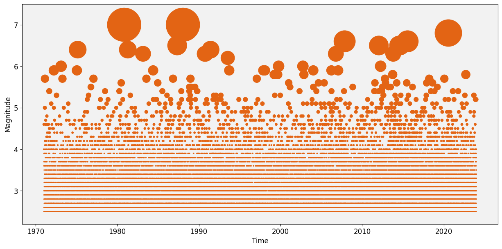
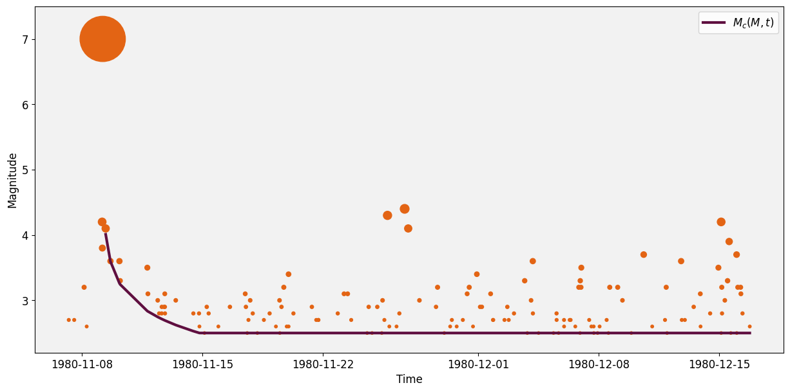

# Synthetic ETAS catalog

We simulate a synthetic catalog using the ETAS model with parameters estimated from ComCat, at $M_c\ 2.5$, within the same California region. 


```python
import numpy as np
import pandas as pd
from shapely.geometry import Polygon
import matplotlib.pyplot as plt
import logging
import sys
import math
import json
import warnings
warnings.filterwarnings('ignore')
from scipy.ndimage import uniform_filter1d
from etas import set_up_logger
from etas.inversion import round_half_up
from etas.simulation import generate_catalog
from filter_catalog_incompleteness import find_mainshock_times, apply_detection_threshold
sys.path.append('..')
from plot_utils import azimuthal_equidistant_projection, maxc
# Custom Colormap
colors = ["#5F0F40", "#C9DAEA", "#84A07C", "#E36414", "#39A9DB", "#0081A7", "#284B63", "#FFD449"]
```

## Example run of `etas.simualtion`

The simulation parameters are stored in the file `simulate_ETAS_California_catalog_config.json`, which we can pass to `etas.simulation` [1]. This cell runs another simulation, without writing the catalog to a file.


```python
# reads configuration for example ETAS parameter inversion
with open("simulate_ETAS_California_catalog_config.json", 'r') as f:
    simulation_config = json.load(f)

region = Polygon(np.load(simulation_config["shape_coords"]))

synthetic = generate_catalog(
    polygon=region,
    timewindow_start=pd.to_datetime(simulation_config["burn_start"]),
    timewindow_end=pd.to_datetime(simulation_config["end"]),
    parameters=simulation_config["parameters"],
    mc=simulation_config["mc"],
    beta_main=simulation_config["beta"],
    delta_m=simulation_config["delta_m"]
)

synthetic.magnitude = round_half_up(synthetic.magnitude, 1)
synthetic.index.name = 'id'
print("\nDONE!")
```

    
    DONE!


## EarthquakeNPP ETAS Synthetic catalog

Let's read the synthetic catalog from EarthquakeNPP and visualise it.


```python
with open("simulate_ETAS_California_catalog_config.json", 'r') as f:
        config = json.load(f)

catalog = pd.read_csv(
                config["fn_store"],
                index_col=0,
                parse_dates=["time"],
                dtype={"url": str, "alert": str},
            )

catalog = catalog.sort_values(by='time')
print('the catalog has', len(catalog),'events')
```

    the catalog has 90862 events


We can see that the simulator groups the magnitudes into Mw 0.1 bins.


```python
%matplotlib inline
plt.figure(figsize=(15, 7))
plt.gca().set_facecolor((0.95, 0.95, 0.95))

z = (9.5**catalog['magnitude'])*0.0005
plt.scatter(catalog['time'],catalog['magnitude'],s=z,color =colors[3])
plt.xlabel('Time',fontsize=12)
plt.ylabel('Magnitude',fontsize=12)
plt.xticks(fontsize=12)
plt.yticks(fontsize=12)
plt.ylim([2.2,7.5])
plt.show()
```


    

    


Since ETAS uses the great-circle distance between two points on a sphere (km), for the NPPs we need to project the coordinates of the events into a space such that inter-event distances are in km. To do this, we can use the Azimuthal equidistant projection [2], which preserves distances from all points to a center point.

We pass the mean coordinates of the catalog as the center coordinates of the projection.


```python
center_latitude = catalog['latitude'].mean()  # Latitude of the center point
center_longitude = catalog['longitude'].mean()  # Longitude of the center point

# Convert latitude and longitude to Cartesian coordinates using Plate Carrée projection
catalog['x'], catalog['y'] = azimuthal_equidistant_projection(catalog['latitude'], catalog['longitude'], center_latitude, center_longitude)
```


```python
catalog.head()
```


<div>
<style scoped>
    .dataframe tbody tr th:only-of-type {
        vertical-align: middle;
    }

    .dataframe tbody tr th {
        vertical-align: top;
    }

    .dataframe thead th {
        text-align: right;
    }
</style>
<table border="1" class="dataframe">
  <thead>
    <tr style="text-align: right;">
      <th></th>
      <th>latitude</th>
      <th>longitude</th>
      <th>time</th>
      <th>magnitude</th>
      <th>x</th>
      <th>y</th>
    </tr>
    <tr>
      <th>id</th>
      <th></th>
      <th></th>
      <th></th>
      <th></th>
      <th></th>
      <th></th>
    </tr>
  </thead>
  <tbody>
    <tr>
      <th>22028</th>
      <td>42.484284</td>
      <td>-118.810157</td>
      <td>1971-01-01 04:13:56.578288436</td>
      <td>2.5</td>
      <td>609.747831</td>
      <td>51.909082</td>
    </tr>
    <tr>
      <th>80505</th>
      <td>33.314329</td>
      <td>-119.357659</td>
      <td>1971-01-01 23:38:01.984298359</td>
      <td>2.5</td>
      <td>-410.080902</td>
      <td>7.862907</td>
    </tr>
    <tr>
      <th>29956</th>
      <td>35.672898</td>
      <td>-119.007235</td>
      <td>1971-01-02 10:44:43.103773479</td>
      <td>2.9</td>
      <td>-147.734591</td>
      <td>39.295596</td>
    </tr>
    <tr>
      <th>51414</th>
      <td>41.562394</td>
      <td>-124.739464</td>
      <td>1971-01-02 17:14:24.495743244</td>
      <td>2.5</td>
      <td>519.767657</td>
      <td>-440.942778</td>
    </tr>
    <tr>
      <th>51962</th>
      <td>42.493774</td>
      <td>-118.891605</td>
      <td>1971-01-03 00:38:01.411354356</td>
      <td>2.6</td>
      <td>610.759650</td>
      <td>45.213501</td>
    </tr>
  </tbody>
</table>
</div>


```python
catalog.to_csv("ETAS_California_catalog.csv")
```

## Generating the incomplete catalog

Let's now filter this catalog using the time-dependent formula from [3]

$$M_c(M,t) = M/2 - 0.25 - \log_{10}(t),$$
where $M$ is the mainshock magnitude. Events below this threshold are removed using mainshocks of Mw 5.2 and above.


```python
# Set the magnitude threshold for mainshock selection
magnitude_threshold = 5.2

# Find the mainshock times
mainshock_times = find_mainshock_times(catalog, magnitude_threshold)

print('Number of Mainshocks:', len(mainshock_times))

# Apply detection threshold to aftershocks of each mainshock
filtered_catalog = apply_detection_threshold(catalog, mainshock_times)

print("Original number of events:", len(catalog))
print("Number of events after applying time and magnitude dependent detection threshold:", len(filtered_catalog))

```

    Number of Mainshocks: 146


    Original number of events: 90862
    Number of events after applying time and magnitude dependent detection threshold: 89744


We can see how events have been removed under the line $M_c(M,t)$.


```python
%matplotlib inline
plt.figure(figsize=(15, 7))
plt.gca().set_facecolor((0.95, 0.95, 0.95))


# Find the index of the largest earthquake by magnitude
largest_earthquake_index = np.where(filtered_catalog['magnitude'].to_numpy()==filtered_catalog['magnitude'].max())[0][0]-6

# Get the 150 earthquakes preceding the largest one
start_index = largest_earthquake_index
df_preceding = filtered_catalog.iloc[largest_earthquake_index:largest_earthquake_index+150]

# Compute time_dependent line
M = filtered_catalog['magnitude'].max()
time_days = (df_preceding['time'] - df_preceding['time'].iloc[6]).dt.total_seconds() / (24 * 3600)
time_dependent = np.maximum(M / 2 - 0.25 - np.log10(time_days),2.5)

# Plotting
z = (3.5**df_preceding['magnitude'])*0.4
plt.scatter(df_preceding['time'], df_preceding['magnitude'], color=colors[3], s=z)
plt.plot(df_preceding['time'], time_dependent, color=colors[0], linewidth=3,label=r'$M_c(M,t)$')
plt.xlabel('Time',fontsize=12)
plt.ylabel('Magnitude',fontsize=12)
plt.ylim([2.2,7.5])
plt.xticks(fontsize=12)
plt.yticks(fontsize=12)
plt.legend(fontsize=12)
plt.show()
```


    

    


We apply the Azimuthal equidistant projection as before and write to a file.


```python
filtered_catalog[["latitude", "longitude", "time", "magnitude","x","y"]].to_csv("ETAS_California_incomplete_catalog.csv")
```

## References

[1]: Leila Mizrahi, Nicolas Schmid, and Marta Han. lmizrahi/etas, 2022. URL https://doi.415
org/10.5281/zenodo.6583992.

[2]: Bradley, A. D. (1945). Azimuthal Equidistant Projection of the Sphere. The American Mathematical Monthly, 52(3), 148-151.

[3]: Page, M. T., van der Elst, N., Hardebeck, J., Felzer, K., & Michael, A. J. (2016). Three ingredients for improved global aftershock forecasts: Tectonic region, time‐dependent catalog incompleteness, and intersequence variability. Bulletin of the Seismological Society of America, 106(5), 2290-2301.
