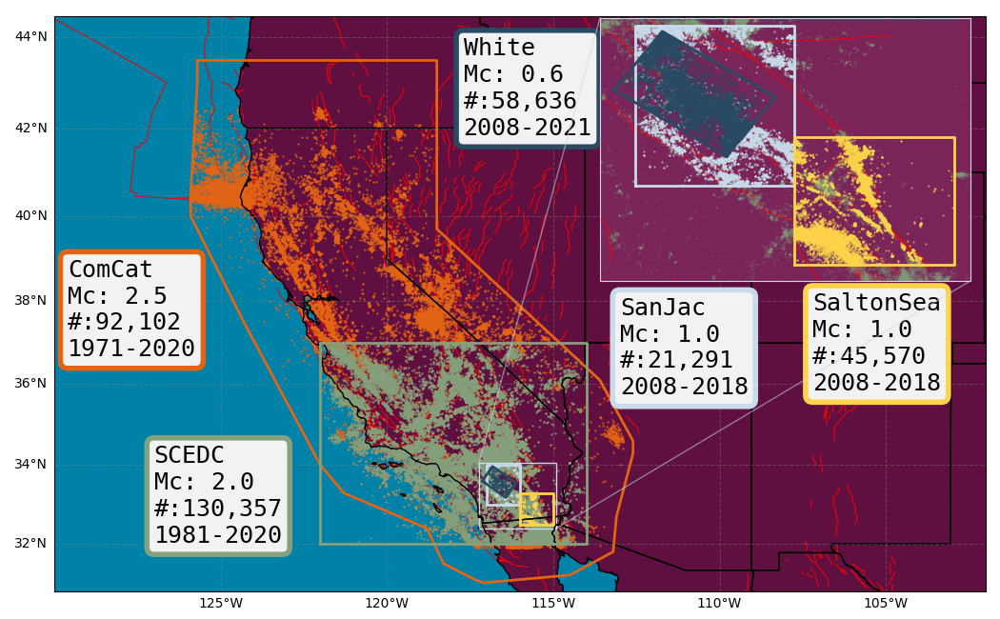

# EarthquakeNPP: Benchmark Datasets for Earthquake Forecasting with Neural Point Processes

EarthquakeNPP is an expanding collection of benchmark datasets designed to facilitate testing of Neural Point Processes (NPP) on earthquake data. The datasets are accompanied by an implementation of the Epidemic-Type Aftershock Sequence (ETAS) model, currently considered the benchmark forecasting model in the seismology community. Derived from publicly available raw data, these datasets undergo processing and configuration to support forecasting experiments relevant to stakeholders in seismology. The datasets cover various regions of California, representing typical forecasting zones and the data commonly available to forecast issuers. Several datasets include much smaller magnitude earthquakes thanks to modern algorithms for detection and dense seismic networks.




## Setup

1. Clone the repository and its submodules:
   ```bash
   git clone --recurse-submodules https://github.com/ss15859/EarthquakeNPP.git
   ````
2. Navigate to the cloned directory:
   ```bash
    cd EarthquakeNPP
    ```
3. Create the conda environment:
    ```bash
    conda env create -f environment.yml
    ```
4. Activate the conda environment:
    ```bash
    conda activate earthquakeNPP
    ```

## Datasets

All the datasets in EarthquakeNPP are derived from publicly available raw earthquake catalogs. The `Datasets/` directory contains notebooks to process and configure each dataset for earthquake forecasting experiments, to benchmark NPP models against the ETAS model. These notebooks outline how to download, analyze, and finally truncate the raw data (in space, time, and magnitude) for the benchmarking experiments. The pre-processed data can also be found in `Datasets/`, allowing users to proceed directly to the benchmarking experiments if desired.

### [ComCat](https://github.com/ss15859/EarthquakeNPP/tree/main/Datasets/ComCat)

The Advanced National Seismic System (ANSS) Comprehensive Catalog of Earthquake Events and Products (ComCat) is produced and maintained by the U.S. Geological Survey (USGS) National Earthquake Information Center (NEIC). The raw earthquake catalog contains global earthquakes of Mw 4.5 or larger and earthquakes within the United States of Mw 3.0 or larger. Our pre-processed dataset (`ComCat_25`) focuses on the whole of California with earthquakes above Mw 2.5.

- **License:** USGS-authored or produced data and information are considered to be in the U.S. Public Domain.
- **Credit:** U.S. Geological Survey, Department of the Interior/USGS. Visit the USGS at [https://usgs.gov](https://usgs.gov).

### [SCEDC](https://github.com/ss15859/EarthquakeNPP/tree/main/Datasets/SCEDC)

The Southern California Earthquake Data Center (SCEDC) is the archive of the Caltech/USGS Southern California Seismic Network (SCSN). It is funded by the U.S. Geological Survey (USGS) and the California Office of Emergency Services (CalOES). Its primary mission is to distribute data recorded or processed by the SCSN, a component of the California Integrated Seismic Network (CISN).

EarthquakeNPP contains three magnitude thresholds of the raw earthquake catalog at Mw (2.0, 2.5, 3.0): `SCEDC_20`, `SCEDC_25`, `SCEDC_30`.

- **License:** SCEDC hereby grants the non-exclusive, royalty-free, non-transferable, worldwide right and license to use, reproduce, and publicly display in all media public data from the Southern California Seismic Network.
- **Credit:** SCEDC (doi:10.7909/C3WD3xH1), SCSN (doi:10.7914/SN/CI)

### [QTM](https://github.com/ss15859/EarthquakeNPP/tree/main/Datasets/QTM)

Using data collected by the Southern California Seismic Network (SCSN), Ross et al. [(2019)](https://www.science.org/doi/10.1126/science.aaw6888) generated a denser catalog by reanalyzing the same waveform data with a template matching procedure that looks for cross-correlations with the wavetrains of previously detected events. Their resulting catalog, containing 1.81 million earthquakes, is hosted by the Southern California Earthquake Data Center (SCEDC).

EarthquakeNPP contains two datasets derived from this raw catalog, focusing on the San Jacinto fault region (`SanJac_10`) and the Salton Sea (`SaltonSea_10`). Both of these datasets contain earthquakes down to Mw 1.0.

- **License:** SCEDC hereby grants the non-exclusive, royalty-free, non-transferable, worldwide right and license to use, reproduce, and publicly display in all media public data from the Southern California Seismic Network.
- **Credit:** SCEDC (doi:10.7909/C3WD3xH1), SCSN (doi:10.7914/SN/CI)

### [White](https://github.com/ss15859/EarthquakeNPP/tree/main/Datasets/White)

White et al. [(2019)](https://agupubs.onlinelibrary.wiley.com/doi/full/10.1029/2019JB017641) created an enhanced catalog focusing on the San Jacinto fault region, using a dense seismic network in Southern California. The processed EarthquakeNPP dataset (`WHITE_06`) contains earthquakes down to Mw 0.6 within a constrained region of the raw catalog.

- **License:** This dataset is licensed under a Creative Commons Attribution 4.0 International license.

### [ETAS](https://github.com/ss15859/EarthquakeNPP/tree/main/Datasets/ETAS)

EarthquakeNPP contains a synthetic earthquake catalog of California generated using the `etas` Python package. The parameters used to simulate the dataset are derived by fitting an ETAS model to the `ComCat_25` dataset. Events from the simulated dataset (`ETAS_25`) are removed to create a second dataset (`ETAS_incomplete_25`), emulating the missing data that typically follows large earthquakes.

- **License:** MIT License, Copyright (c) 2024 ETH Zurich, Leila Mizrahi
- **Credit:** etas (doi: 10.5281/zenodo.6583992)

### [Japan](https://github.com/ss15859/EarthquakeNPP/tree/main/Datasets/Japan)

This first iteration of EarthquakeNPP focuses on California. However, another dataset `Japan_25` is included in the benchmarking experiment to compare against the previous work by Chen et al. [(2020)](https://arxiv.org/pdf/2011.04583), Zhou et al. [(2022)](https://arxiv.org/pdf/2112.06351), and Zhou et al. [(2024)](https://openreview.net/pdf?id=Deb1yP1zMN). Future iterations of EarthquakeNPP will include other region-wide experiments on active seismic areas such as Japan, New Zealand, and Italy.

`Japan_25` is derived from the same Advanced National Seismic System (ANSS) Comprehensive Catalog of Earthquake Events and Products (ComCat) produced by the U.S. Geological Survey (USGS).

- **License:** USGS-authored or produced data and information are considered to be in the U.S. Public Domain.
- **Credit:** U.S. Geological Survey, Department of the Interior/USGS. Visit the USGS at [https://usgs.gov](https://usgs.gov).


## Experiments


### Licenses

This project uses code from the following repositories, each under their respective licenses:

1. AutoSTPP: MIT License
2. etas: MIT License
3. neural_stpp: Attribution-NonCommercial 4.0 International (CC BY-NC 4.0)

For more details on the licenses, please refer to the LICENSE files in the respective repositories.

